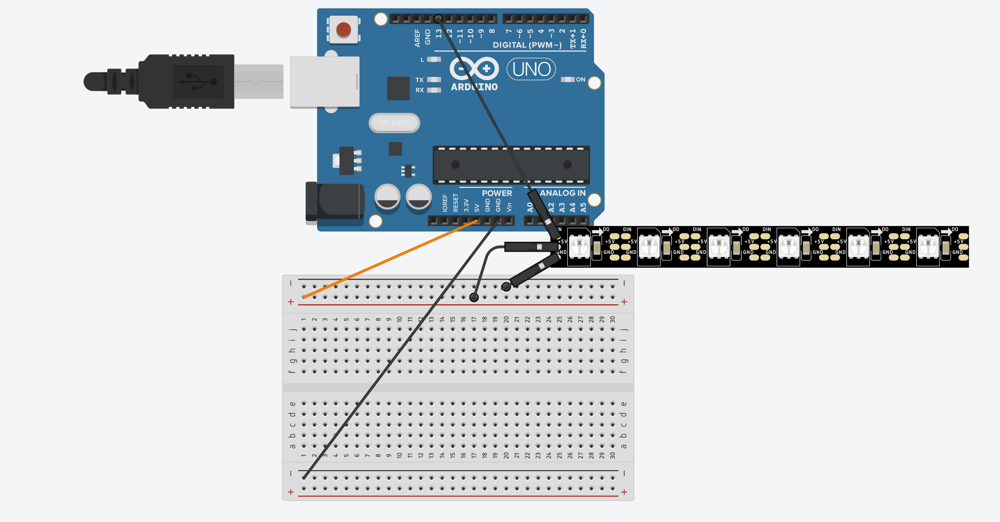
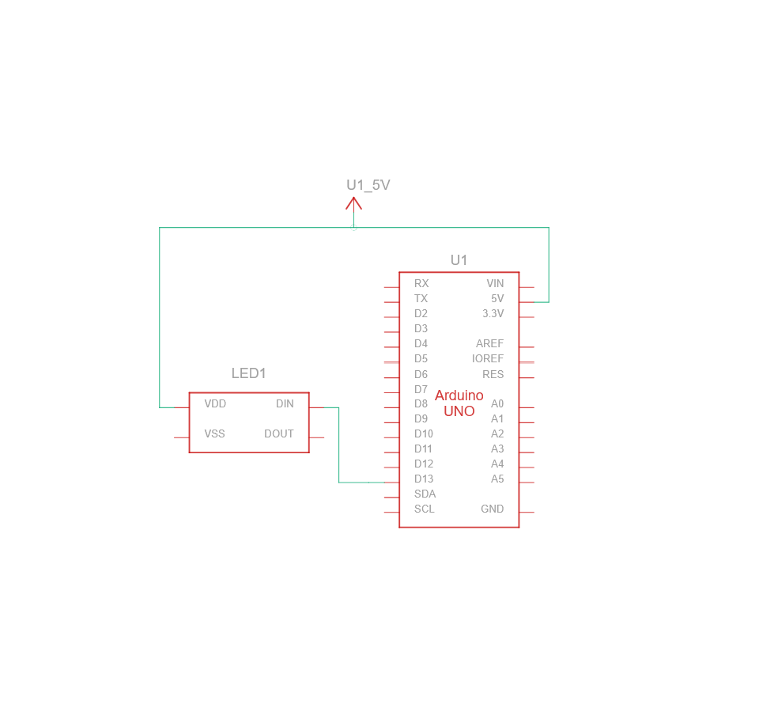

# Project 1 : sketch_mar29a_ProjectNewOne

The purpose of this project was to build a device to test the amount of Electromagnetic energy in the area surrounding it.
I have used 4 different sizes of aerials to see if there is a difference. It turns out they do all read different amounts.

## Powerpoint

[Embedded Systems Presentation](Embedded%20Systems%20presentation.pptm)

## Diagram

## Schematic

